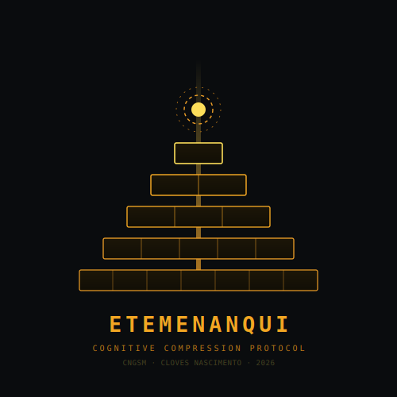

<div align="center">



# ETEMENANQUI

[](./LICENSE)
[-EF9F27?style=flat-square&labelColor=0A0C0E)](./docs/metodologia.md)
[](./lexicon.json)
[](https://github.com/clovesnascimento/etemenanqui/actions)

**Linguagem de protocolo para compressão de prompts em sistemas de IA**

*"Etemenanqui" — em sumério: templo da fundação do céu e da terra*

[Metodologia](#metodologia) · [Resultados](#resultados) · [Léxico](./lexicon.json) · [Pipeline](#pipeline) · [Instalação](#instalação)

</div>

---

## Motivação

O mito da Torre de Babel descreve como uma única linguagem permitiu à humanidade construir estruturas inimagináveis — até que a fragmentação da comunicação interrompeu a obra. Os tokenizadores modernos como o BPE recriaram essa fragmentação: fatiam o conhecimento de forma opaca e desperdiçam processamento computacional.

A linguagem natural carrega cerca de **50% de redundância** (Shannon, 1948). Prompts técnicos enviados a LLMs pagam esse custo integralmente em tokens. O Etemenanqui é uma resposta de engenharia a esse problema.

---

## O que é

Uma **linguagem de protocolo** — não uma língua natural nem uma linguagem de programação. Domínio de aplicação: comunicação densa de instrução técnica com modelos de linguagem (*system prompts*, arquiteturas *plan-and-solve*, pipelines de validação).

```
Inglês técnico:   "Initialize context window. Load grammar rules."
Etemenanqui:      "siso ranta . kalo reze ."
```

---

## Arquitetura — Modelo B

| Componente | Especificação |
|---|---|
| Consoantes | `t k n m s v l r z b` (10) |
| Vogais | `a e i o` (4) |
| Estrutura de raiz | **CVC** — 3 caracteres |
| Marcadores | **V** ou **CV** — fundidos sem hífen |
| Teto morfológico | máx. 2 marcadores → palavra ≤ 7 chars |
| Fonotática | sem clusters CC, sem ditongos VV |

**Por que sem hífen?** O hífen é tokenizado como símbolo separado pelo BPE, representando 26% do custo total sem carregar informação semântica. O Modelo B elimina esse custo por fusão direta.

```
Modelo A (anterior):   tavo-ro   → 4 tokens  (tav + o + - + ro)
Modelo B (definitivo): tavro     → 2 tokens  (tav + ro)
```

### Marcadores

| Marcador | Função | Tipo |
|---|---|---|
| `o` | AGENTE | Caso (V) |
| `a` | OBJETO | Caso (V) |
| `e` | DATIVO | Caso (V) |
| `i` | GENITIVO | Caso (V) |
| `ta` | PASSADO | Tempo (CV) |
| `so` | PRESENTE | Tempo (CV) |
| `ki` | FUTURO | Tempo (CV) |
| `me` | PLURAL | Número (CV) |
| `zi` | NEGAÇÃO | Modalidade (CV) |
| `li` | AUMENTATIVO | Grau (CV) |
| `ba` | NOMINALIZADOR | Derivação (CV) |

---

## Resultados

Corpus técnico limpo — 15 blocos, ~350 palavras. Comparação contra inglês técnico sem palavras funcionais.

| Camada | Métrica | Inglês Técnico | Etemenanqui | Ratio |
|---|---|---|---|---|
| L1 — Teto teórico | H_char (Shannon) | 4.388 | 3.523 | **0.803 ▼** |
| L2 — Arquitetural | gz_ratio | 0.441 | 0.357 | **0.808 ▼** |
| L2 — Arquitetural | gz_bytes absolutos | 1.050 B | 529 B | **0.504 ▼** |
| L3 — Custo real | Tokens BPE (simulado ±15%) | 678 | 503 | **0.742 ▼** |
| L3 — Custo real | Tokens/palavra | 1.79 | 1.41 | **0.787 ▼** |

> **Diagnóstico: ✓✓✓** — economia confirmada em todas as três camadas.
>
> Intervalo de confiança BPE: `0.631 — 0.742 — 0.853`

### Fronteira epistêmica

O tokenizador `cl100k_base` foi treinado primariamente em inglês. Isso cria fricção entre a eficiência teórica do Etemenanqui e seu custo computacional real. A economia plena só se realizaria com um tokenizador co-treinado — o que exigiria um LLM próprio. No contexto atual, o ganho é real mas parcial: **0.63–0.85 tokens por token inglês equivalente** no domínio técnico.

---

## Metodologia

Três camadas de métricas independentes — intencionalmente **não colapsadas** em score único.

```
L1 — Entropia de Shannon    → teto teórico
L2 — Razão gzip (LZ77)      → eficiência arquitetural
L3 — Tokens BPE (tiktoken)  → custo real computacional
```

Os *gaps* entre camadas são o dado científico relevante — não o score médio.

---

## Pipeline

```bash
python etemenanqui_pipeline.py
```

Executa as três camadas e exporta resultados em JSON.

```python
# Validação de corpus
from etemenanqui import validar_corpus

resultado = validar_corpus("texto.txt")
# → {"R1": True, "R2": True, "R3": {"ta": 70, "so": 65, "ki": 71}}
```

---

## Instalação

```bash
git clone https://github.com/clovesnascimento/etemenanqui.git
cd etemenanqui
pip install tiktoken          # para validação BPE real
python etemenanqui_pipeline.py
```

---

## Estrutura do repositório

```
etemenanqui/
├── README.md
├── logo_gold.svg                    # logo oficial
├── social_preview.svg               # banner 1280×640
├── lexicon.json                     # 52 raízes CVC
├── etemenanqui_pipeline.py          # pipeline L1+L2+L3
├── corpus/
│   ├── corpus_tecnico_EN.txt
│   └── corpus_tecnico_ET.txt
├── docs/
│   └── metodologia.md
└── .github/
    └── workflows/
        └── validate.yml             # CI de validação
```

---

## Questão filosófica

> *Se uma língua atingir compressão perfeita e eliminar toda redundância,*
> *ela preserva espaço para ambiguidade poética, emoção humana e evolução cultural orgânica?*

Os dados respondem: o Etemenanqui carrega menos bits de informação por token que o inglês técnico (7.26 vs 12.37 bits/token BPE). Sua regularidade é o que o torna compressível — mas essa mesma regularidade elimina sinônimos, registros e variação expressiva. É uma língua de protocolo, não de cultura. A redundância que Shannon chamou de "canal de segurança" é também o espaço onde a poesia habita.

---

## Referências

- Shannon, C.E. (1948). *A Mathematical Theory of Communication*. Bell System Technical Journal.
- Sennrich, R. et al. (2016). *Neural Machine Translation of Rare Words with Subword Units*. ACL.
- Zipf, G.K. (1935). *The Psycho-Biology of Language*.
- *Gênesis 11:1–9* — narrativa da Torre de Babel.
- George, A. (2005). *In Search of the Fabled Tower*. British Museum.

---

<div align="center">

**CNGSM — Cognitive Neural & Generative Systems Management**

*Cloves Nascimento — Arquiteto de Ecossistemas Cognitivos*

*Etemenanqui - Criado em 13 de março de 2026*

</div>
